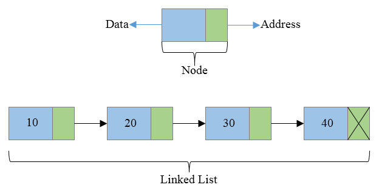

# Forløb 13
## Datastrukturer - Kø og Stak

Datastrukturer er en struktur af data og dertilhørende operationer og algoritmer.

Datastrukturer er en uundværlig del af algoritmer.

--------------------------------------------------------------------------------------

## Køer og stakke

De to meste elementære datastrukturer er en "Kø" og en "Stak". De indgår i alle mulige almindelige sammenhænge med også i mere komplicerede algoritmer, såsom Edsger Wybe Dijkstras korteste-vej algoritme.


--------------------------------------------------------------------------------------

## Køer og stakke

Opgaven i dag er at implementere disse to strukturer vha. en såkaldt linked-list implementation.

Nedenfor en illustartion.



Her ses en forslag til implementation af klassen Node:

```java
class Node{
  int value; // Data kan selvfølgelig være andet end int
  Node next; // dette er linked til den næste node - som ses på illustartionen
}

```

--------------------------------------------------------------------------------------

## opgaver

- Byg klassen Node
- Skriv en test kode hvor du forsøger at hæfte 3 nodes sammen
- Lav en funktion der tager en Node som argument og udskriver alle de noder der linker til denne
- Kø:
  - Lav en klasse kaldet Queue
  - Den skal indholde to funktioner "enqueue" og "dequeue", der hhv. indsætter og fjerner elementer korrekt fra køen
  - test din klasse
- Stak:
  - Lav en klasse kaldet Stack
  - Den skal indholde to funktioner "put" og "get, der hhv. indsætter og fjerner elementer korrekt fra stakken
  - test din klasse
