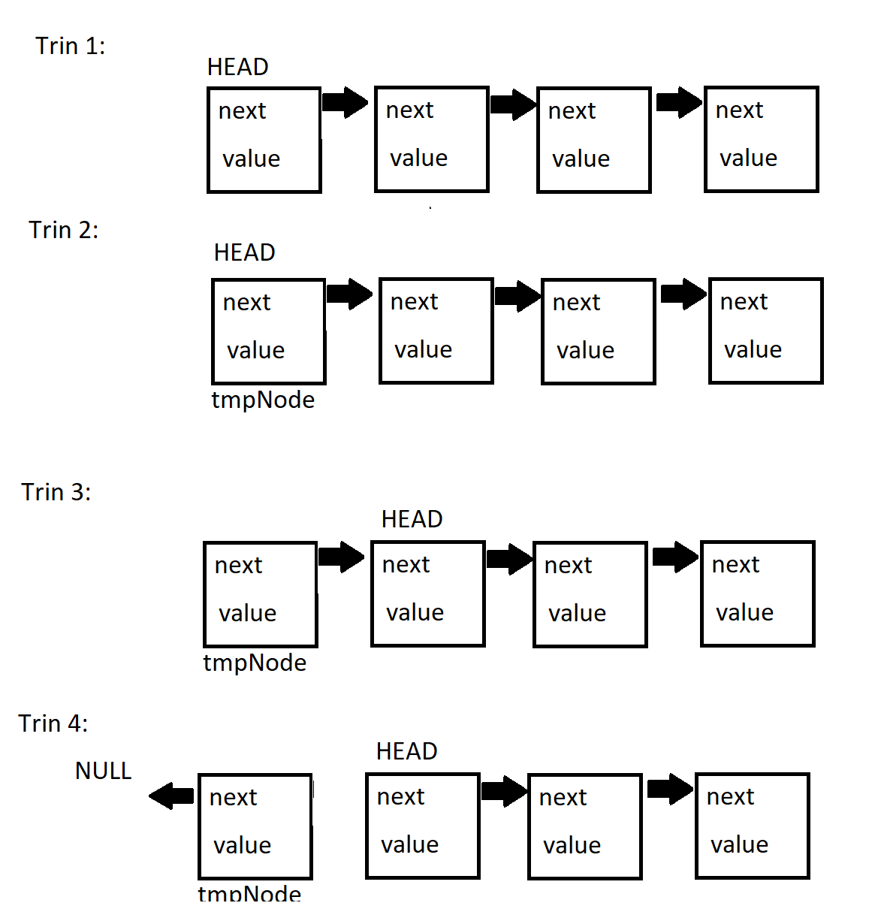

# Forløb 13 - 3.Del
## Datastrukturer - Slet element i en stack

For at færdigøre jeres stak er det også nødvendigt at kunne slette elementer.

Nedenfor ses en illustration af hvordan man kan slette et element:

