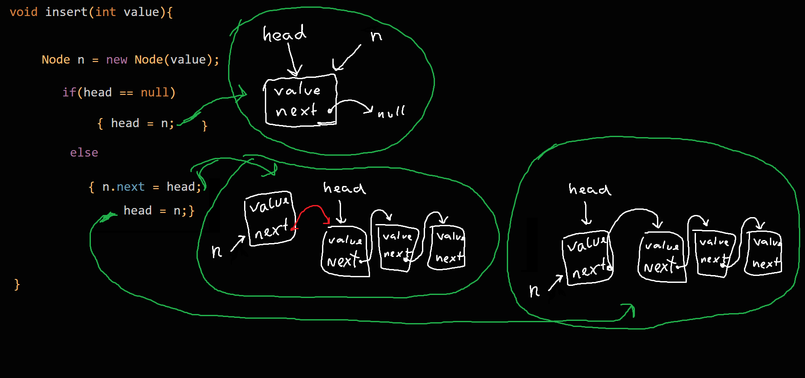

# Løsning: linkedlist stack & insert

Her ses et løsningsforslag til hvordan man kan implementere "insert" i en stak, bygget med en linkedlist. Denne stak indeholder værdier der er af typen "integers", men datatypen er selvfølgelig valgfri.   

Kodeimplementationen er kompakt for at selve koden fylder mindre.

En linked-list er opbygget af Nodes. Her ses Node-klassen:
```java
class Node{
  int value; Node next;
  Node(int v){  value = v;}
}
```

-----------------------------------------------------------------------------------------------------------------------

Selve stak-klassen og "insert" kan implementeres således:
```java
class Stack{
  Node head;

  void insert(int value){
    Node n = new Node(value);
    if(head == null){ head = n;                }
    else            { n.next = head;  head = n;}
  }

  void udskriv(){
    for(Node n=head ; n!=null ; n=n.next) print(n.value + " ");  
  }
}
```

Her ser i en tegning af hvordan insert-funktionen fungerer:     


-----------------------------------------------------------------------------------------------------------------------


Anvendelsen af stakken kunne se således ud
```java
void setup(){
  Stack s = new Stack();
  s.insert(1);s.insert(2);s.insert(3);
  s.udskriv();
}
```
