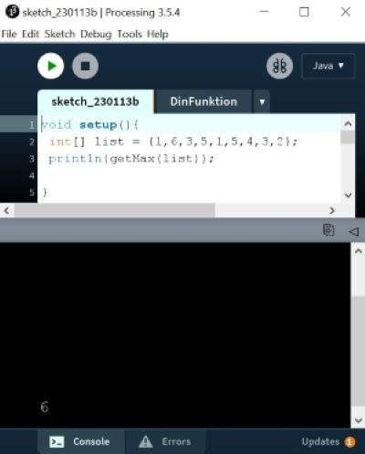
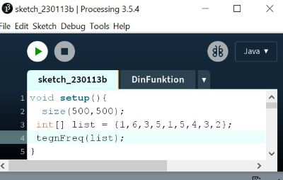

# Rep1 : Diverse opgaver i 2D-grafik, variabler,

## opgave 1 - arrays, loops, if-statements og funktioner
Byg funktionen getMax, der finder det største tal i et heltals-array,
prøv at lave en løsning både med og uden brug af processings "max":    

## opgave 2 - arrays, loops og funktioner
Byg funktionen printFreq. Der udskriver hvor mange gange hvert tal forekommer i et heltals-array.
Du kan godt antage at arrayet kun indeholder positive tal:    

## opgave 3 - variabler og koordinater
Byg funktionen tegnFreq der tegner et søjle-diagram, istedet for at udskrive forkomster af hvert tal i arrayet, som i opgave 2:  

       

## opgave 4 - variabler og koordinater
Byg en trekant:   

## opgave 5 - variabler og koordinater
Trekanten skal dreje:

<iframe width="320" height="560" src="https://www.youtube.com/embed/LCfWZW-Cz7c" title="drej" frameborder="0" allow="accelerometer; autoplay; clipboard-write; encrypted-media; gyroscope; picture-in-picture; web-share" allowfullscreen></iframe>

## opgave 6 - variabler og koordinater
Trekanten skal dreje i retningen af musen:

<iframe width="320" height="560" src="https://www.youtube.com/embed/vixMarUggUU" title="followMouse" frameborder="0" allow="accelerometer; autoplay; clipboard-write; encrypted-media; gyroscope; picture-in-picture; web-share" allowfullscreen></iframe>

# opgave 7
Trekanten skal dreje i retningen af musen, men kun når man klikker:

<iframe width="320" height="560" src="https://www.youtube.com/embed/oHcv8U_XqfQ" title="followMouseWhenClick" frameborder="0" allow="accelerometer; autoplay; clipboard-write; encrypted-media; gyroscope; picture-in-picture; web-share" allowfullscreen></iframe>
