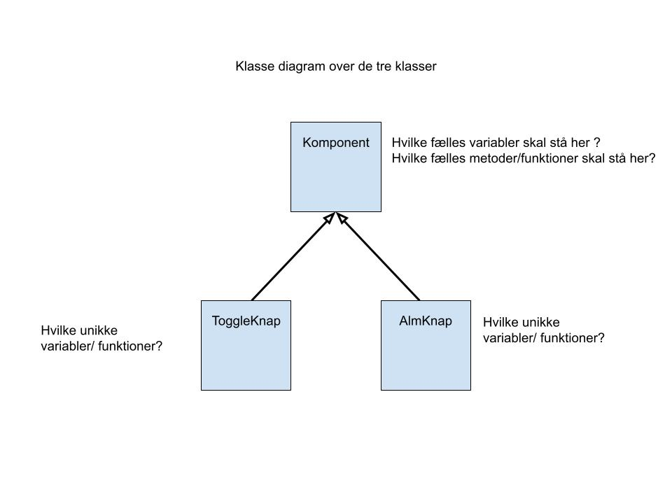

# Forløb 1
## Lav dit eget GUI-bibliotek
### OOP Repetition & Nedarvning, Superklasse-komponent, Almindelig-knap, Toggle-knap

Først et oplæg hvor vi repeterer grundlæggende objektorienteret Programmering   
[slides_oop_rep.pdf](slides_oop_rep.pdf)  
*Varighed ca. 30 minutter* 

Så et oplæg om polymorfi, der hænger tæt sammen med nedarvning og override af metoder    
[slides_polymorfi.pdf](slides_polymorfi.pdf)  
*Varighed ca. 30 minutter*

Herefter tager tager lige en snak om hvad forskellen er på nedarvning og polymorfi!

## Logbog
*varighed ca. 30 minutter*

Skriv et lille afsnit i din log-bog om følgende begreber:  
[vigtige begreber oop](vigtige_begreber_oop.md).  
Giv også gerne eksempler.  

**Aflevering: Upload et link til lectio-opgaven "Link til logbog"**

## Kode-opgave : Knap hierakiet påbegyndes

Det første i skal lave i jeres gui-bibliotek er et hieraki af knap-klasser.

Lav en komponent-klasse. Lav derefter to sub-klasser, en toggle-knap-klasse og en almindelig-knap-klasse.  
Begge knap-klasser skal nedarve fra komponent-klassen.
Kode der er ens i de to knap-klasser flyttes op i komponent-klassen, så man undgår kode gentagelser.

Udtænk et lille "eksempel" hvor i anvender jeres almindelige-knap og jeres toggle-knap. Husk at lave eksemplet meget simpelt, da det kun skal bruges til at teste jeres knapper og ikke koste særlig meget tid at lave.   
Nedenfor har jeg lavet en kode, hvor jeg viser et eksempel med hvad jeg kalder en "bank-app", det er bare et forslag.   
Bagefter viser jeg også et forslag til hvilke metoder, variabler og noget af den kode man skal skrive.

<iframe width="560" height="315" src="https://www.youtube.com/embed/5RM4t27l1u0" title="YouTube video player" frameborder="0" allow="accelerometer; autoplay; clipboard-write; encrypted-media; gyroscope; picture-in-picture" allowfullscreen></iframe>

Det er vigtigt at man ikke blander kode ind i knap-klasserne, der er andet end knap-kode!   
Husk et bibliotek skal kunne bruges af alle uden man skal ændre i bibliteks-koden.

**Aflevering: Upload en zip-fil til lectio-opgaven "Knap hierakiet"**
